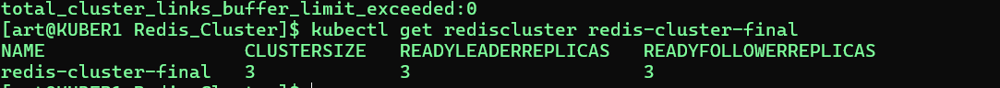
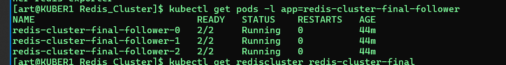
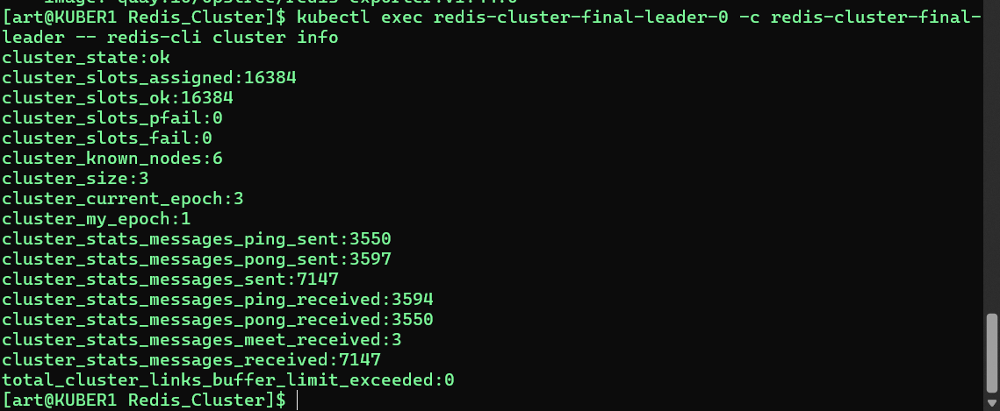
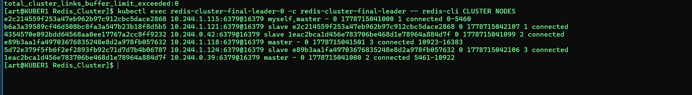
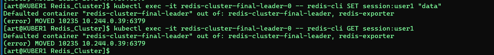

# Решение задач кластеризации и распределённого кеша

## Задача 1: Кластеризация

**Решение:** Использовать **Kubernetes**.

### Соответствие требованиям

| Требование | Как обеспечивается в Kubernetes |
|------------|--------------------------------|
| Поддержка контейнеров | Работает с Docker, containerd, CRI-O |
| Обнаружение сервисов и маршрутизация запросов | `Service` (ClusterIP, NodePort, LoadBalancer) + `Ingress` |
| Горизонтальное масштабирование | `Deployment` / `ReplicaSet` – изменение числа реплик |
| Автоматическое масштабирование | Horizontal Pod Autoscaler (HPA) по CPU, памяти, метрикам |
| Разделение внешних и внутренних ресурсов | `Service` ClusterIP (внутренний), LoadBalancer/Ingress (внешний); `NetworkPolicy` |
| Конфигурирование через переменные среды и безопасное хранение секретов | `ConfigMap` (обычные переменные), `Secret` (пароли, ключи) – подключаются как env или тома |

### Обоснование

Kubernetes — промышленный стандарт оркестрации контейнеров. Все требуемые механизмы реализованы нативно, есть огромное сообщество, поддержка всех облачных провайдеров, возможность работы от одного сервера до тысяч узлов.

---

## Задача 2: Распределённый кеш (Redis Cluster)

### Условие

Разработчикам нужен Redis Cluster из трёх шардов с тремя репликами (всего 6 нод: 3 мастера + 3 реплики).  
Предоставлен файл `redis-cluster-final.yaml`:

```yaml
apiVersion: redis.redis.opstreelabs.in/v1beta2
kind: RedisCluster
metadata:
  name: redis-cluster-final-follower
spec:
  clusterSize: 3
  clusterVersion: v7

  persistenceEnabled: true

  kubernetesConfig:
    image: quay.io/opstree/redis:v7.0.12
    imagePullPolicy: IfNotPresent
    resources:
      requests:
        cpu: "100m"
        memory: "128Mi"
      limits:
        cpu: "500m"
        memory: "512Mi"

  storage:
    nodeConfVolume: true
    nodeConfVolumeClaimTemplate:
      spec:
        accessModes:
          - ReadWriteOnce
        storageClassName: local-path
        resources:
          requests:
            storage: 1Gi

    volumeClaimTemplate:
      spec:
        accessModes:
          - ReadWriteOnce
        storageClassName: local-path
        resources:
          requests:
            storage: 5Gi

  redisConfig:
    dynamicConfig:
      - "cluster-enabled yes"
      - "cluster-node-timeout 5000"
      - "cluster-require-full-coverage no"
      - "appendonly yes"
      - "protected-mode no"
      - "bind 0.0.0.0"

  redisExporter:
    enabled: true
    image: quay.io/opstree/redis-exporter:v1.44

```


# 1. Установить Redis Operator (если не установлен)
```
kubectl apply -k github.com/OT-CONTAINER-KIT/redis-operator//config/default?ref=v0.15.0
```
# 2. Применить манифест
```
kubectl apply -f redis-cluster-final.yaml
```


# 3. Проверить состояние кластера
```
kubectl get rediscluster redis-cluster-final
```



# 4. Посмотреть все поды кластера (должно быть 6 подов)
```
 kubectl get pods -l app=redis-cluster-final-follower
```

```

kubectl exec redis-cluster-final-leader-0 -c redis-cluster-final-leader -- redis-cli cluster info
```


# 5. Проверить топологию кластера
```
kubectl exec redis-cluster-final-leader-0 -c redis-cluster-final-leader -- redis-cli CLUSTER NODES

```




# 6. Проверить, что данные сохраняются (persistence)
```
kubectl exec -it redis-cluster-final-leader-0 -- redis-cli SET session:user1 "data"
kubectl exec -it redis-cluster-final-leader-0 -- redis-cli GET session:user1
```
